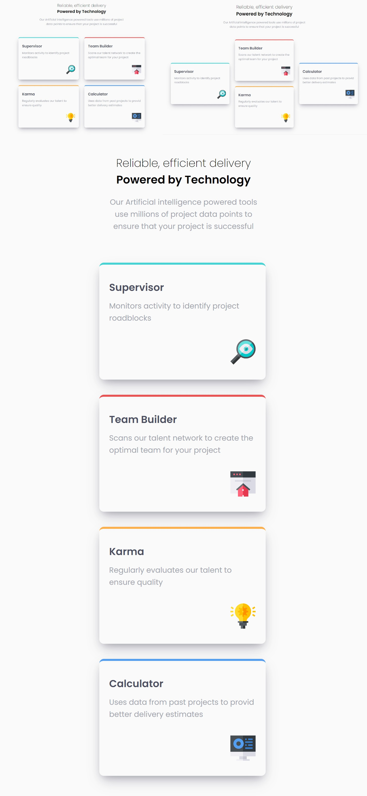

# Frontend Mentor - Four card feature section solution

This is my solution to the [Four card feature section challenge on Frontend Mentor](https://www.frontendmentor.io/challenges/four-card-feature-section-weK1eFYK)

## The challenge

Users should be able to:

- View the optimal layout for the site depending on their device's screen size

## Links

- [Solution URL](https://www.frontendmentor.io/challenges/manage-landing-page-SLXqC6P5)
- [Live Site URL](https://jhon-okayda-manage-landing-page.netlify.app/)

## Built with

- React JS
- SCSS
- BEM

## Author

- Created by - okayda-jhon
